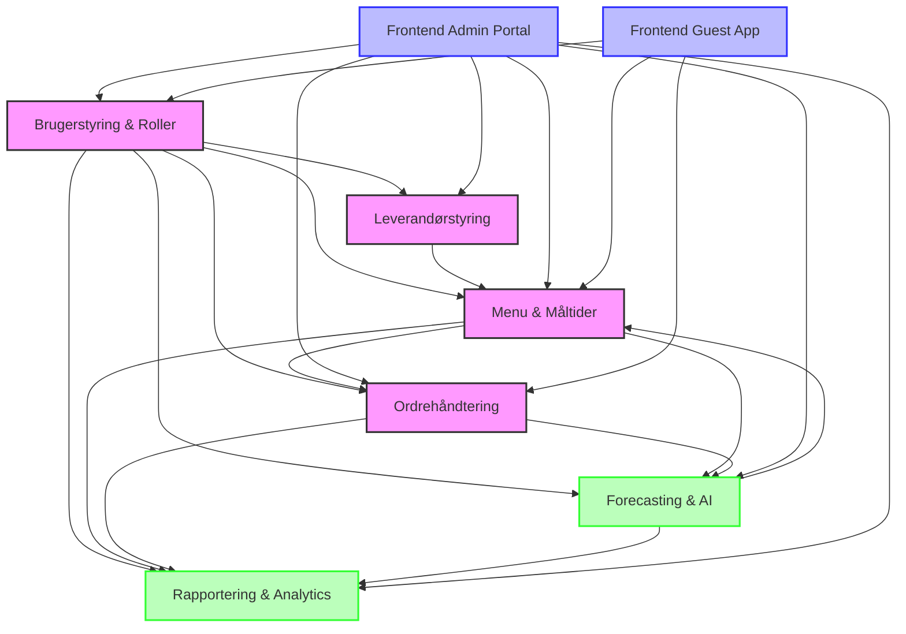

# Kanteeno Moduloversigt

Dette diagram viser en oversigt over alle moduler i Kanteeno-systemet og deres indbyrdes afhængigheder.

## Moduldiagram

## Modulbeskrivelser

### Kernekomponenter
- **Brugerstyring & Roller**: Håndterer brugeradministration, autentificering og adgangskontrol.
- **Menu & Måltider**: Håndterer oprettelse og administration af menuer og måltider.
- **Ordrehåndtering**: Håndterer bestilling, betaling og levering af måltider.
- **Leverandørstyring**: Håndterer leverandører, kontrakter og indkøb.
- **Rapportering & Analytics**: Håndterer rapportering, dataanalyse og visualisering.

### AI-komponenter
- **Forecasting & AI**: Håndterer forudsigelse af efterspørgsel, anbefalinger og optimering.

### Frontend-komponenter
- **Frontend Admin Portal**: Administrationsportal til styring af systemet.
- **Frontend Guest App**: Brugervendt app til bestilling af måltider.

## Teknologier

- **Backend**: Node.js, Express, MongoDB
- **Frontend**: React
- **AI**: Python, TensorFlow/PyTorch
- **Containerization**: Docker, Docker Compose
