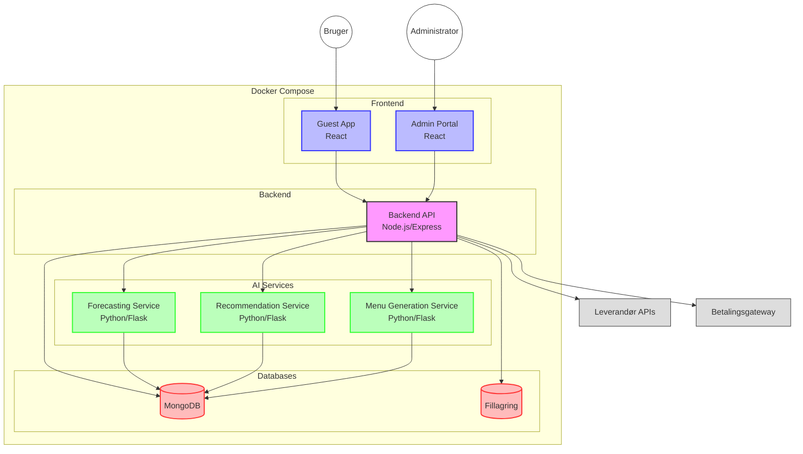

# Kanteeno Teknisk Arkitektur

Dette diagram viser den tekniske arkitektur for Kanteeno-systemet, herunder komponenter, teknologier og dataflow.

## Arkitekturdiagram

## Komponentbeskrivelser

### Frontend
- **Guest App**: React-baseret webapplikation til slutbrugere, hvor de kan se menuer, bestille måltider og administrere deres profil.
- **Admin Portal**: React-baseret webapplikation til administratorer, hvor de kan administrere systemet, herunder brugere, menuer, ordrer, leverandører, etc.

### Backend
- **Backend API**: Node.js/Express-baseret API, der håndterer alle forretningslogik, autentificering, datavalidering og kommunikation med databaser og eksterne tjenester.

### Databaser
- **MongoDB**: NoSQL-database til lagring af alle data i systemet, herunder brugere, menuer, måltider, ordrer, etc.
- **Fillagring**: Lagring af filer, herunder billeder af måltider, dokumenter, etc.

### AI-tjenester
- **Forecasting Service**: Python/Flask-baseret tjeneste til forudsigelse af efterspørgsel på måltider.
- **Recommendation Service**: Python/Flask-baseret tjeneste til personaliserede anbefalinger af måltider.
- **Menu Generation Service**: Python/Flask-baseret tjeneste til automatisk generering af menuer.

### Eksterne integrationer
- **Leverandør APIs**: Integration med leverandørers API'er til automatisk bestilling af råvarer.
- **Betalingsgateway**: Integration med betalingstjenester til håndtering af betalinger.

## Teknologier

### Frontend
- React
- Redux
- Material-UI
- Axios

### Backend
- Node.js
- Express
- JWT for autentificering
- Mongoose (MongoDB ORM)

### Databaser
- MongoDB
- GridFS (til fillagring i MongoDB)

### AI
- Python
- Flask
- TensorFlow/PyTorch
- Pandas/NumPy

### Containerization
- Docker
- Docker Compose

### CI/CD
- GitHub Actions
- Jest (til testing)
- ESLint (til linting)
